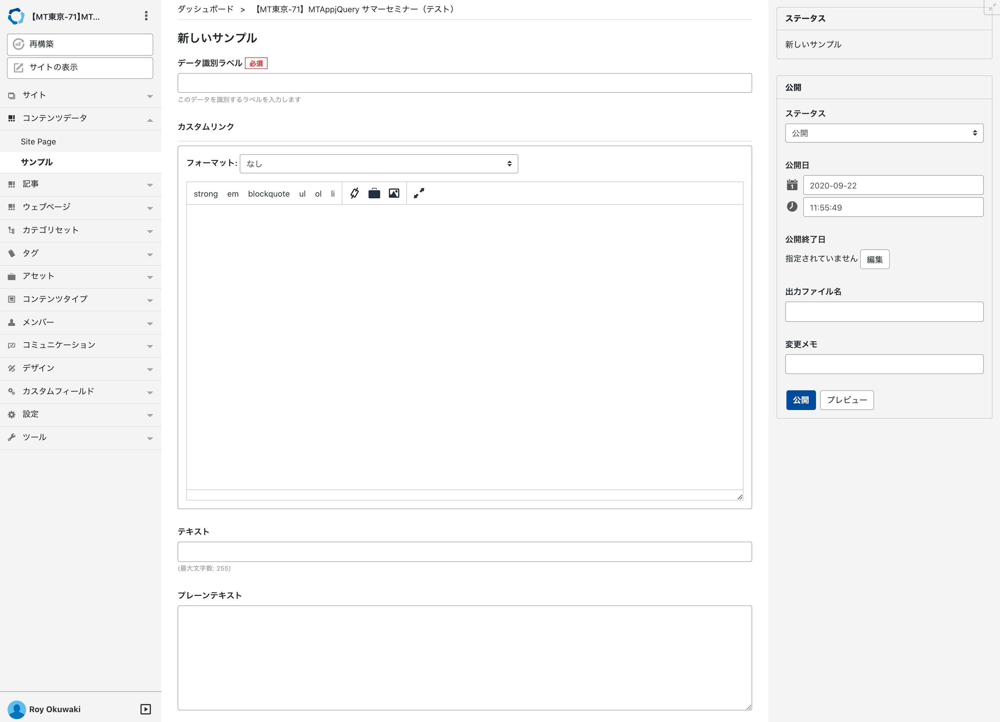
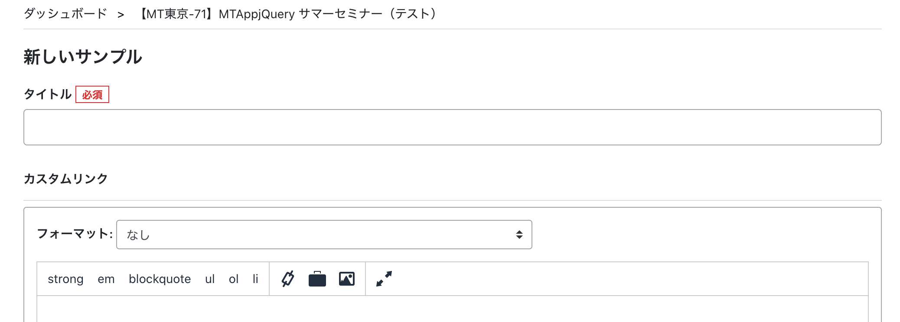
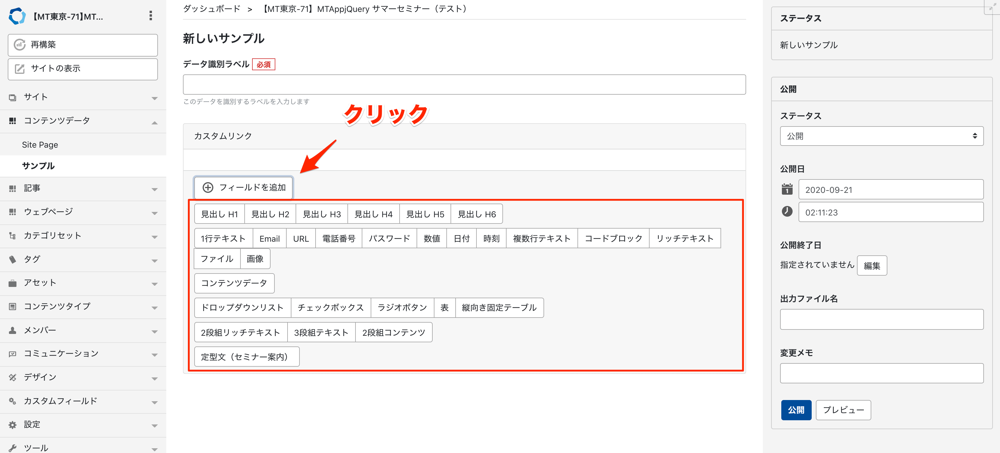
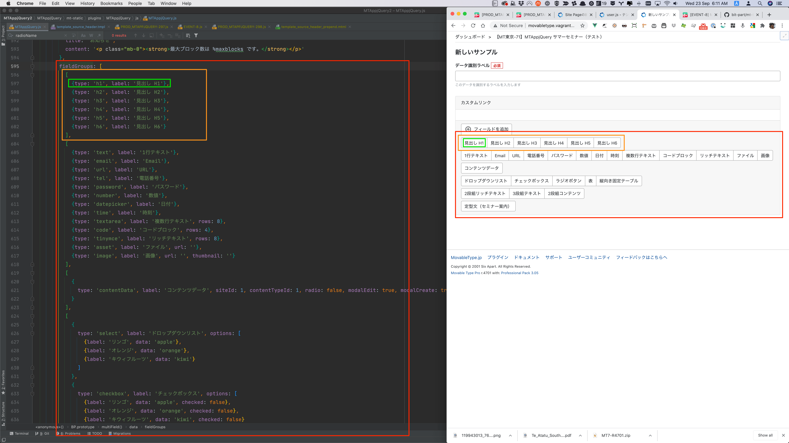
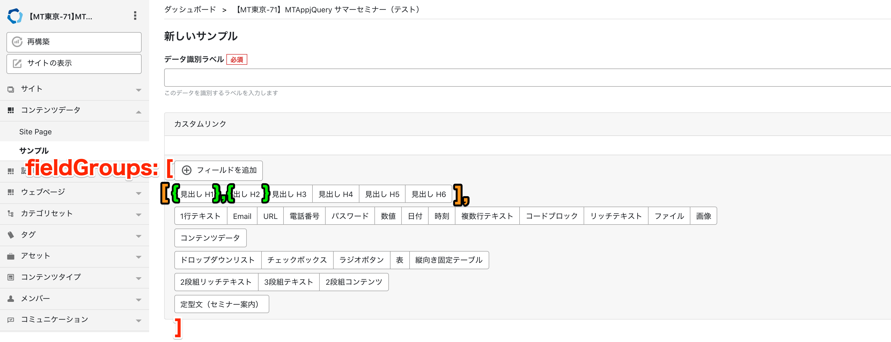
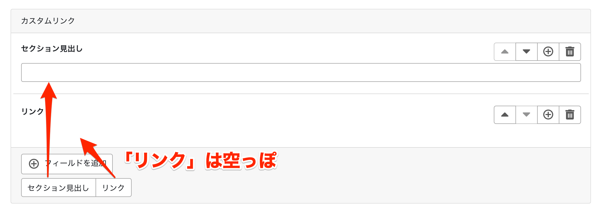
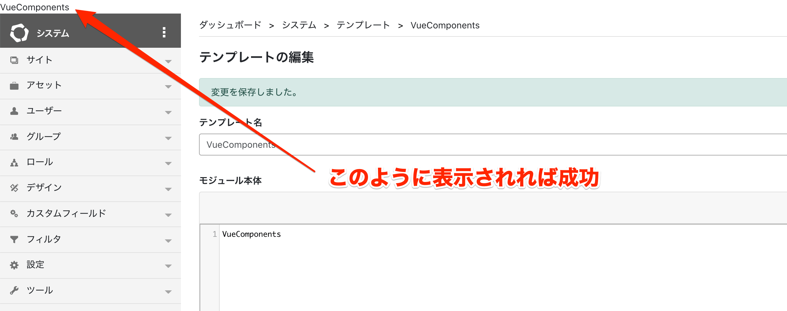
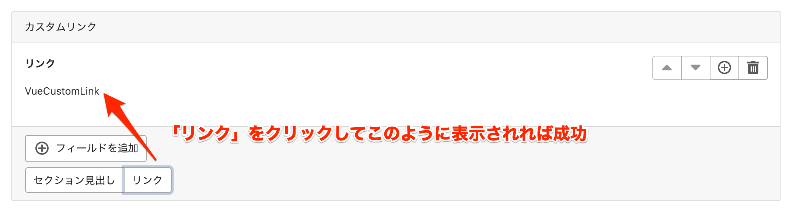
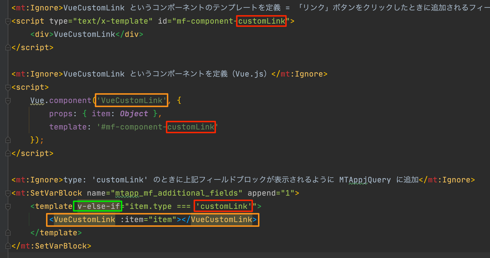
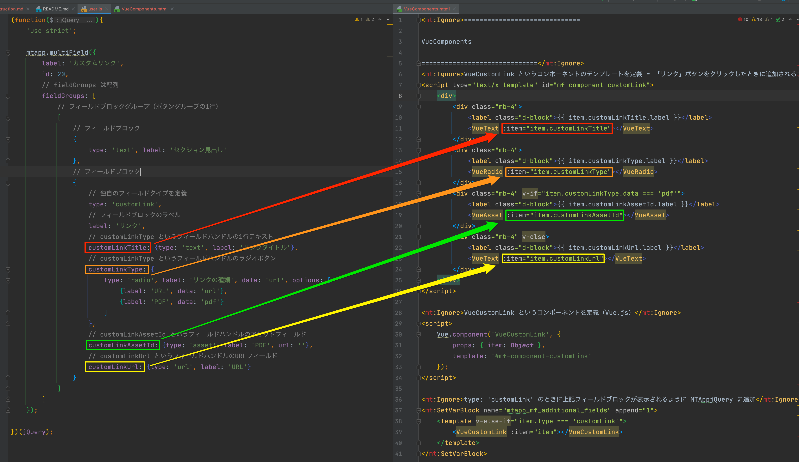

# 【MT東京-71】MTAppjQuery サマーセミナー

## プラグインのインストール

下記のリンクから zip ファイルをダウンロードして展開します。  
https://www.dropbox.com/t/5HDopilyB4bBV2m5

`plugins` ディレクトリ内の `MTAppjQuery` `DataAPIProxy` `PlainTextField` プラグインをアップロードします。

`mt-static/plugins` ディレクトリ内の `MTAppjQuery` プラグインをアップロードします。


## DataAPIProxy プラグインのパーミッションの設定

アップロードした `DataAPIProxy` ディレクトリの中に `dataapiproxy.cgi` というファイルがあります。

このファイルのパーミッションを `755` など `mt.cgi` と同じパーミションに変更します。

> 【参考】MTAppjQuery と Data API proxy を組み合わせて管理画面で Data API を快適に使う   
> https://tinybeans.net/blog/2017/07/21-120008

## システムメニューの MTAppjQuery プラグインの設定

1. システムメニューを表示
1. 左サイドメニューの `設定 > プラグイン` に移動
1. `MTAppjQuery 2.5.2` の `設定` を開く
1. `管理画面での DataAPI の利用` を `有効` `Data API バージョン : v4` を選択
1. PSGI モードで運用している場合は `baseUrl` を「 `mt.cgi を除く管理画面のURL + dataapiproxy.cgi` 」となるように変更

##　サイトの作成

今回は下記のようなサイトを作成します。既存のサイトを利用する場合はわざわざ作る必要はありません。

```
# サイトテーマ
Mont-Blanc

# サイト名
【MT東京-71】MTAppjQuery サマーセミナー

# サイトURL
http://movabletype.vagrant/mt-tokyo-71/

# サイトパス
/var/www/html/mt-tokyo-71

# タイムゾーン
UTC+9(日本標準時)

# 使用言語
日本語
```

## Webサービス設定

該当サイトの左サイドメニューの `設定 > Webサービス` に移動し、 `Data API のアクセスを許可する。` にチェックを入れて保存します。

## コンテンツタイプの作成

1. 左サイドメニューの `コンテンツタイプ > 新規` に移動
1. 名前に `サンプル` と入力
1. 「テキスト（複数行）」フィールドをドラッグ・アンド・ドロップ
    - 名前に `カスタムリンク` と入力
    - 「入力フォーマット」で `なし` を選択
1. 「テキスト」フィールドをドラッグ・アンド・ドロップ
    - 名前に `テキスト` と入力
1. 「プレーンテキスト」フィールドをドラッグ・アンド・ドロップ
    - 名前に `プレーンテキスト` と入力
1. 保存
1. 左サイドメニューの `コンテンツデータ > サンプル` に移動
1. 「サンプルを作成」をクリック
1. 「カスタムリンク」「テキスト」「プレーンテキスト」フィールドが存在するのを確認



## user.js のインストール

1. 左サイドメニューの `デザイン > テンプレート` に移動
1. 右サイドメニューの `user.jsとuser.cssをインストール` をクリック
1. インデックステンプレートにインストールされた `user.css` `user.js` を選択して「公開」をクリック

## カスタマイズの練習 1 : 簡単なメソッドを利用

データ識別ラベルは任意の必須のフィールドの値を自動で入れることができます。
例えば、書籍データを管理するコンテンツタイプでは、書名や ISBN コードをデータ識別ラベルとして利用することが考えられます。
そういった場合は、データ識別ラベルのフィールドが一番上にあるのは違和感があります。
そこで、データ識別ラベルのフィールドを右サイドバーの中に移動してしまいましょう。

1. `user.js` の編集画面を開く
1. 下記の内容を `user.js` 編集画面にコピペして「保存と再構築」をクリック

```
(function($){
    'use strict';

    mtapp.dataLabelCustomize({
      insertBefore: '#basename-field'
    });

})(jQuery);
```

### Tips

ちょっと機能を試したい、というときはブラウザの開発者ツールのコンソールに、上記の user.js に書いたものと同じコードを貼り付けて実行すると手軽に試すことができて便利です。その際、コード全体を、

```
(function($){

})(jQuery);
```

で囲むことを忘れないようにしてください。

## カスタマイズの練習 2 : 独自の JavaScript でカスタマイズ

次は、MTAppjQuery が提供するメソッドではなく、独自のコードでカスタマイズしてみましょう。

- 「データ識別ラベル」を「タイトル」に変更
- 「このデータを識別するラベルを入力します」を非表示
- テキストフィールドのサイズを大きくする

1. `user.js` の編集画面を開く
1. 下記の内容を `user.js` 編集画面にコピペして「保存と再構築」をクリック

```
(function($){
    'use strict';

    // 「データ識別ラベル」を「タイトル」に変更
    const $dataLabel = $('#data_label-field').children('label');
    const dataLabelHtml = $dataLabel.html();
    $dataLabel.html(dataLabelHtml.replace(/データ識別ラベル/, 'タイトル'));
    
    // 「このデータを識別するラベルを入力します」を非表示
    $('#data_label-help').hide();
    
    // テキストフィールドのサイズを大きくする
    document.getElementById('data_label').classList.add('form-control-lg');
    
})(jQuery);
```



## カスタマイズの練習 3 : 人気メソッドで複数のフィールドをタブでまとめる

次は、複数のフィールドをタブで表示してみます。

1. `user.js` の編集画面を開く
1. 下記の内容を `user.js` 編集画面にコピペして「保存と再構築」をクリック

```
(function($){
    'use strict';

    mtapp.tabs({
        content: [{
            label: '基本情報',
            selector: '#contentField21'
        },{
            label: '詳細情報',
            selector: '#contentField22'
        }],
        pointer: '#data_label-field',
        method: 'after'
    });
})(jQuery);
```

## カスタマイズの練習 4 : 開発/本番を間違える事故をなくそう

開発環境と本番環境がある場合、どちらの環境で作業しているかをわかるようにしてみます。

```
(function ($) {
    'use strict';
    
    switch (location.hostname) {
        case 'movabletype.vagrant': {
            $('body').prepend('<div class="alert alert-info text-center m-0 h1">開発 / Development</div>');
            break;
        }
        case 'movabletype.nz': {
            $('body').prepend('<div class="alert alert-danger text-center m-0 h1">本番 / Production</div>');
            break;
        }
    }

})(jQuery);
```

## カスタマイズの練習 5 : JavaScript ライブラリを利用

intro.js を使ってチュートリアル機能を実装してみます。

```
(function ($) {
    'use strict';
    
    $('[name="data_label"]').attr({
        'data-step': 1,
        'data-intro': 'タイトルを入力してください。'
    });
    $('[name="content-field-21"]').attr({
        'data-step': 2,
        'data-intro': 'キャッチコピーを入力してください。'
    });
    $('[name="content-field-22"]').attr({
        'data-step': 3,
        'data-intro': '詳細情報を入力してください。'
    });
    $('[name="status"]').attr({
        'data-step': 4,
        'data-intro': 'ステータスを選択してください。'
    });
    $('[type="submit"].primary').attr({
        'data-step': 5,
        'data-intro': '保存/公開してください。'
    });
    introJs().start();

})(jQuery);
```

## カスタマイズの練習 5 : 目玉機能のマルチフィールドの利用

マルチフィールドとは？ => https://youtu.be/o8lDNUNJgqg

1. `user.js` の編集画面を開く
1. 右サイドメニューの「コンテンツタイプ」で「サンプル」を選択
1. 右サイドメニューの「コンテンツフィールド」で「カスタムリンク」を選択し ID の数字をコピー
1. 下記の内容の `id` の数字を上でコピーした数字に変更して、コードを `user.js` 編集画面にコピペして「保存と再構築」をクリック

```
(function($){
  'use strict';
  
  mtapp.multiField({
    label: 'カスタムリンク',
    id: 20
  });
  
})(jQuery);
```

先程の「サンプルを作成」ページに移動し「カスタムリンク」フィールドが下図のようになっていれば成功



## 表示用のインデックステンプレートを作成

- サイトの左サイドメニューの `デザイン > テンプレート` に移動
- 右上のドロップダウンリストから「インデックステンプレート」を選んで「新規作成」をクリック
- 下記の情報でインデックステンプレートを作成して

```
# テンプレート名
マルチフィールド

# テンプレートの内容
マルチフィールド

# 出力ファイル名
index.html

# テンプレートの種類
カスタムインデックステンプレート
```

- テンプレートを保存
- テンプレートを保存と再構築
- 右サイドメニューの「公開されたテンプレート」をクリック

```
マルチフィールド
```

とだけ表示されれば成功

## データの取り出し

下記のテンプレートを上記のマルチフィールドテンプレートに貼り付けて「保存と再構築」をします。

このテンプレートで、マルチフィールドに保存されている各フィールドブロックの名前（ `label` ）と種類（ `type` ）、そしてそのフィールドブロックのデータ（ `JSON` ）を確認できます。

```
<mt:Contents content_type="2" note="ご自身の環境に合わせて変更してください">
    <mt:ContentField content_field="13" note="ご自身の環境に合わせて変更してください">
        <mt:ContentFieldValue convert_breaks="0" json_decode="1" setvar="json" />
        <mt:Var name="json" key="items" setvar="items" />
    </mt:ContentField>

    <mt:Foreach name="items" as="item">
        <h2><mt:NestVar name="item.type" />: <mt:NestVar name="item.label" /></h2>
        <pre><mt:Var name="item" to_json="1"></pre>
    </mt:Foreach>
</ul>
</mt:Contents>
```

### MTForeach

配列を効率よくループすることができるブロックタグです。 `name` モディファイアで指定した配列の各アイテムを `as` モディファイアで指定した変数に格納してループします。

```
<mt:Foreach name="items" as="item">
  do something
</mt:Foreach>
```

### MTNestVar

入れ子の配列・連想配列からドットシンタックスで効率よくデータを取得できます。 `name` モディファイアでドットシンタックスで階層が深い変数を効率よく取得します。

```
<mt:Foreach name="items" as="item">
  <mt:NestVar name="item.data">
</mt:Foreach>
```

これらのタグを利用して、各フィールドブロックの `type` や `label` で条件分岐して、各フィールドブロックの値を出力していきます。

### 条件分岐で出力するパターン

```
<mt:Contents content_type="2">
    <mt:ContentField content_field="13">
        <mt:ContentFieldValue convert_breaks="0" json_decode="1" setvar="json" />
        <mt:Var name="json" key="items" setvar="items" />
    </mt:ContentField>

    <mt:Foreach name="items" as="item">
        <mt:IfNestVar name="item.label" eq="見出し H1">
            <h1><mt:NestVar name="item.data" /></h1>
        </mt:IfNestVar>
        <mt:IfNestVar name="item.label" eq="見出し H2">
            <h2><mt:NestVar name="item.data" /></h2>
        </mt:IfNestVar>
        <mt:IfNestVar name="item.label" eq="複数行テキスト">
            <p><mt:NestVar name="item.data" nl2br="html" /></p>
        </mt:IfNestVar>
    </mt:Foreach>
</mt:Contents>
```

### SetVarTemplate で出力するパターン

```
<mt:SetVarTemplate name="見出し H1">
    <h1><mt:NestVar name="item.data" /></h1>
</mt:SetVarTemplate>

<mt:SetVarTemplate name="見出し H2">
    <h2><mt:NestVar name="item.data" /></h2>
</mt:SetVarTemplate>

<mt:SetVarTemplate name="複数行テキスト">
    <p><mt:NestVar name="item.data" nl2br="html" /></p>
</mt:SetVarTemplate>

<mt:Contents content_type="2">
    <mt:ContentField content_field="13">
        <mt:ContentFieldValue convert_breaks="0" json_decode="1" setvar="json" />
        <mt:Var name="json" key="items" setvar="items" />
    </mt:ContentField>

    <mt:Foreach name="items" as="item">
        <mt:NestVar name="item.label" setvar="label" />
        <mt:Var name="$label" />
    </mt:Foreach>
</mt:Contents>
```

## マルチフィールドで利用できるフィールドブロックの定義の構造

マルチフィールドで利用できるフィールドブロックの定義は、 `fieldGroups` オプションで定義します。
その `fieldGroups` オプションの構造は下記の用になっています。

- 「フィールドを追加」をクリックして表示されるボタングループ全体が配列（赤）
- その中に各行のフィールドブロックグループを定義する配列（オレンジ）
- その中に各フィールドブロックを定義するオブジェクト（緑）





## カスタマイズの練習 6 : 【中・上級編】マルチフィールドに独自のフィールドを追加する

- リンクのタイトルを入力
- リンク先を URL で指定するか、アップロードした PDF ファイルにリンクするかを選べる

### 作成するフィールドの定義を追加

```
(function($){
    'use strict';

    mtapp.multiField({
        label: 'カスタムリンク',
        id: 20,
        // fieldGroups は配列
        fieldGroups: [
            // フィールドブロックグループ（ボタングループの1行）
            [
                // フィールドブロック
                {
                    type: 'text', label: 'セクション見出し'
                },
                // フィールドブロック
                {
                    // 独自のフィールドタイプを定義
                    type: 'customLink',
                    // フィールドブロックのラベル
                    label: 'リンク',
                    // customLinkType というフィールドハンドルの1行テキスト
                    customLinkTitle: {type: 'text', label: 'リンクタイトル'},
                    // customLinkType というフィールドハンドルのラジオボタン
                    customLinkType: {
                        type: 'radio', label: 'リンクの種類', options: [
                            {label: 'URL', data: 'url'},
                            {label: 'PDF', data: 'pdf'}
                        ]
                    },
                    // customLinkAssetId というフィールドハンドルのアセットフィールド
                    customLinkAssetId: {type: 'asset', label: 'PDF', url: ''},
                    // customLinkUrl というフィールドハンドルのURLフィールド
                    customLinkUrl: {type: 'url', label: 'URL'}
                }
            ]
        ]
    });

})(jQuery);
```

`user.js` を書き換えて「保存と再構築」をするとカスタムリンクフィールドが下図のようになます。

- 「セクション見出し」をクリックすると1行テキストフィールドブロックが追加されます。
- 「リンク」をクリックすると空っぽのフィールドブロックが追加されます。



### `VueComponents` というグローバルテンプレートモジュールを作成

- ブラウザの別タブでシステムメニューを表示
- システムメニューの左サイドメニューの `デザイン > グローバルテンプレート` に移動
- 画面右上のドロップダウンリストで `テンプレートモジュール` を選択したまま `新規作成` をクリック
- テンプレート名とテンプレート本体に `VueComponents` と入れて保存
- 画面左上に `VueComponents` と表示されれば成功



### `VueComponents` グローバルテンプレートモジュールを編集

カスタムリンク・フィールドブロックの大枠を定義した下記の内容をコピペして保存

```
<mt:Ignore>VueCustomLink というコンポーネントのテンプレートを定義 = 「リンク」ボタンをクリックしたときに追加されるフィールドブロックのテンプレート</mt:Ignore>
<script type="text/x-template" id="mf-component-customLink">
    <div>VueCustomLink</div>
</script>

<mt:Ignore>VueCustomLink というコンポーネントを定義（Vue.js）</mt:Ignore>
<script>
    Vue.component('VueCustomLink', {
        props: { item: Object },
        template: '#mf-component-customLink'
    });
</script>

<mt:Ignore>type: 'customLink' のときに上記フィールドブロックが表示されるように MTAppjQuery に追加</mt:Ignore>
<mt:SetVarBlock name="mtapp_mf_additional_fields" append="1">
    <template v-else-if="item.type === 'customLink'">
        <VueCustomLink :item="item"></VueCustomLink>
    </template>
</mt:SetVarBlock>
```



ポイントは下記の項目を間違えないようにすることです。

- `type` で指定する値と同じものを入れる（赤）
- 上記の `type` で指定する値の先頭に `Vue` をつけてパスカルケースにする（オレンジ）
- `v-else-if` にする（緑）



### `VueCustomLink` コンポーネントの中身を作成

```
<script type="text/x-template" id="mf-component-customLink">
    <div>
        <div class="mb-4">
            <label class="d-block">{{ item.customLinkTitle.label }}</label>
            <VueText :item="item.customLinkTitle"></VueText>
        </div>
        <div class="mb-4">
            <label class="d-block">{{ item.customLinkType.label }}</label>
            <VueRadio :item="item.customLinkType"></VueRadio>
        </div>
        <div class="mb-4" v-if="item.customLinkType.data === 'pdf'">
            <label class="d-block">{{ item.customLinkAssetId.label }}</label>
            <VueAsset :item="item.customLinkAssetId"></VueAsset>
        </div>
        <div class="mb-4" v-else>
            <label class="d-block">{{ item.customLinkUrl.label }}</label>
            <VueText :item="item.customLinkUrl"></VueText>
        </div>
    </div>
</script>
```



### テンプレートで出力

```
<mt:SetVarTemplate name="セクション見出し">
    <h2><mt:NestVar name="item.data" /></h2>
</mt:SetVarTemplate>

<mt:SetVarTemplate name="リンク">
    <mt:IfNestVar name="item.customLinkType.data" eq="url">
        <p><a href="<mt:NestVar name='item.customLinkUrl.data'>"><mt:NestVar name="item.customLinkTitle.data" /></a></p>
    <mt:Else>
        <mt:NestVar name="item.customLinkAssetId.data" setvar="asset_id" />
        <mt:Asset id="$asset_id">
            <p><a href="<mt:AssetURL>"><mt:NestVar name="item.customLinkTitle.data" /></a></p>
        </mt:Asset>
    </mt:IfNestVar>
</mt:SetVarTemplate>

<mt:SetVars>
content_type_id =4
content_field_id =20
</mt:SetVars>
<mt:Contents content_type="$content_type_id">
    <mt:ContentField content_field="$content_field_id">
        <mt:ContentFieldValue convert_breaks="0" json_decode="1" setvar="json" />
        <mt:Var name="json" key="items" setvar="items" />
    </mt:ContentField>

    <mt:Foreach name="items" as="item">
        <mt:NestVar name="item.label" setvar="label" />
        <mt:Var name="$label" />
    </mt:Foreach>
</mt:Contents>
```

## Tips

### メソッド名を忘れた

ドキュメントサイトまたはコンソールを利用しましょう。

```
mtapp.（リストが表示される）
jQuery.fn.mtapp('list');
```

### mtappVars の値が知りたい

```
mtapp.debug();
```

### 管理画面のスタイルガイドを知りたい

https://movabletype.github.io/mt7-style-guide/components/forms.html
